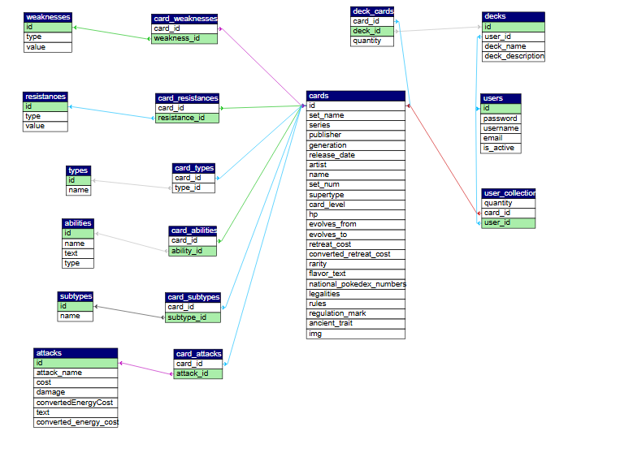

# Tutorial on how to view and use the Pokemine database.

## Table of Contents

- [How to Install and Start XAMPP](#how-to-install-and-start-xampp)
- [How to Start phpMyAdmin from XAMPP](#how-to-start-phpmyadmin-from-xampp)
- [Importing a Database Dump in phpMyAdmin](#importing-a-database-dump-in-phpmyadmin)


# How to Install and Start XAMPP

## Overview
XAMPP is a free and open-source cross-platform web server solution stack package developed by Apache Friends, consisting mainly of the Apache HTTP Server, MariaDB, and interpreters for scripts written in PHP and Perl. This guide will walk you through installing XAMPP and running your local server.


## Prerequisites
- **Operating System**: Windows, macOS, or Linux
- **Administrator Access**: Needed for installation

---

## Step 1: Download XAMPP

1. Open your web browser and go to the [official XAMPP website](https://www.apachefriends.org/index.html).
2. Choose the version of XAMPP compatible with your operating system.
3. Download the latest XAMPP installer for your OS.

---

## Step 2: Install XAMPP

### For Windows
1. Run the installer `.exe` file you downloaded.
2. When prompted by User Account Control, click **Yes** to allow the installation.
3. Follow the installation prompts, choosing components (Apache, MySQL, PHP, etc.) and the installation path as desired. Default components are generally sufficient.
4. Click **Finish** to complete the installation.

### For macOS
1. Open the `.dmg` file you downloaded.
2. Drag the XAMPP folder to your **Applications** directory.
3. Open XAMPP from the Applications folder and follow any additional prompts to complete the setup.

### For Linux
1. Open a terminal in the directory where you downloaded the `.run` file.
2. Run the following command to make it executable:
   ```bash
   chmod +x xampp-linux-x64-<version>.run


# How to Start phpMyAdmin from XAMPP

## Prerequisites
- **XAMPP is running**: Make sure that the Apache and MySQL services are started in the XAMPP Control Panel.

---

## Step-by-Step Guide

1. **Start XAMPP**:
   - Open the **XAMPP Control Panel** on your computer.
   - Ensure that **Apache** and **MySQL** services are **running** (indicated by green status lights).

2. **Access phpMyAdmin**:
   - Open a web browser.
   - Go to [http://localhost/phpmyadmin](http://localhost/phpmyadmin).
   - This URL should open the phpMyAdmin interface.

3. **Log into phpMyAdmin**:
   - By default, XAMPP is configured without a MySQL password for the `root` user.
   - If prompted, leave the password blank and click **Go** or **Login**.

4. **Using phpMyAdmin**:
   - Once logged in, you can manage your MySQL databases, run SQL queries, import/export data, and perform other database management tasks.

---

## Troubleshooting

- **phpMyAdmin not loading**:
  - Verify that both **Apache** and **MySQL** services are running in the XAMPP Control Panel.
  - Ensure there are no port conflicts (check that port **80** for Apache and **3306** for MySQL are open).
  
- **Setting a MySQL root password** (Optional):
  - It’s a good practice to set a password for the MySQL `root` user. You can do this from within phpMyAdmin by navigating to the **User Accounts** section and editing the `root` user credentials.
  
---

With these steps, you’ll be able to access phpMyAdmin and manage your databases effectively in XAMPP!


# Importing a Database Dump in phpMyAdmin

1. **Locate the `pokemine-db.sql` File**:
   - Go to the project repository and find the database dump file with the `.sql` extension.

2. **Open phpMyAdmin**:
   - Go to [http://localhost/phpmyadmin](http://localhost/phpmyadmin).

3. **Import the `.sql` File**:
   - Go to the **Import** tab.
   - Click **Choose File**, select `pokemine-db.sql` file, and click **Go** to import.

4. **Confirmation**:
   - A success message will confirm the import is complete.


---

## Troubleshooting

- **File Size Limit**:
  - If the `.sql` file exceeds the upload limit, increase the values in `php.ini`:
    - Open `php.ini` in the `xampp/php/` folder.
    - Update `upload_max_filesize` and `post_max_size` to a higher value (e.g., `50M`).
    - Restart Apache from the XAMPP Control Panel.

- **Import Errors**:
  - Ensure that the `.sql` file is compatible with your MySQL version.
  - Syntax errors may be due to version differences. When exporting, select compatibility options if needed.

---

# This was just for installing XAMPP; now let’s look at how the database is structured.


## Pokémine Database Diagram



## Explanation of the Tables and Their Roles

### 1. `cards`
The central table that stores each card's unique attributes like name, set, and stats. This table is the **primary entity** in the system, and it connects to other tables through **foreign keys**.

### 2. `weaknesses`, `resistances`, `abilities`, `types`, `attacks`, `subtypes`
These are **supporting tables** that store **specific attributes** related to the cards (e.g., a card's weaknesses, abilities, or types). Rather than storing these attributes directly in the `cards` table, they are broken out into separate tables.

### 3. Linking Tables (e.g., `card_weaknesses`, `card_resistances`, `card_abilities`...)
These tables store the **many-to-many relationships** between `cards` and their attributes. For example:
- `card_weaknesses` links cards to the weaknesses stored in the `weaknesses` table.
- `card_abilities` links cards to the abilities stored in the `abilities` table.

This ensures that a single card can have multiple weaknesses or abilities, and those can be shared across multiple cards.

### 4. `users`, `users_collection`,`decks`, `deck_cards`
These tables manage user-related data and the organization of cards into decks. Each deck belongs to a user and can contain multiple cards. The `deck_cards` table links **specific cards** to **specific decks**.

# Tables Schema
## cards
```sql
  `id` varchar(16) NOT NULL,
  `set_name` varchar(255) DEFAULT NULL,
  `series` varchar(255) DEFAULT NULL,
  `publisher` varchar(255) DEFAULT NULL,
  `generation` varchar(255) DEFAULT NULL,
  `release_date` varchar(255) DEFAULT NULL,
  `artist` varchar(255) DEFAULT NULL,
  `name` varchar(255) DEFAULT NULL, /*pokémon name*/
  `set_num` varchar(255) DEFAULT NULL,
  `supertype` varchar(255) DEFAULT NULL,
  `card_level` varchar(255) DEFAULT NULL,
  `hp` int(11) DEFAULT NULL,
  `evolves_from` varchar(255) DEFAULT NULL,
  `evolves_to` varchar(255) DEFAULT NULL,
  `retreat_cost` varchar(255) DEFAULT NULL,
  `converted_retreat_cost` varchar(255) DEFAULT NULL,
  `rarity` varchar(255) DEFAULT NULL,
  `flavor_text` text DEFAULT NULL,
  `national_pokedex_numbers` varchar(255) DEFAULT NULL,
  `legalities` text DEFAULT NULL,
  `rules` text DEFAULT NULL,
  `regulation_mark` varchar(255) DEFAULT NULL,
  `ancient_trait` text DEFAULT NULL,
  `img` text DEFAULT NULL  /*url card image*/
```

## abilities
```sql
  `id` int(11) NOT NULL,
  `name` varchar(255) DEFAULT NULL,
  `text` varchar(629) NOT NULL, /*ability description*/
  `type` varchar(255) DEFAULT NULL
```
## attacks
```sql
  `id` int(11) NOT NULL,
  `attack_name` varchar(255) DEFAULT NULL,
  `cost` varchar(255) DEFAULT NULL,
  `damage` varchar(255) DEFAULT NULL,
  `convertedEnergyCost` int(11) NOT NULL,
  `text` varchar(472) DEFAULT NULL, /*attack description*/
  `converted_energy_cost` int(11) NOT NULL
```
## weaknesses
```sql
  `id` int(11) NOT NULL,
  `type` varchar(255) DEFAULT NULL,
  `value` varchar(255) DEFAULT NULL
```
## resistances
```sql
  `id` int(11) NOT NULL,
  `type` varchar(255) DEFAULT NULL,
  `value` varchar(255) DEFAULT NULL
```
## subtypes
```sql
  `id` int(11) NOT NULL,
  `name` varchar(255) DEFAULT NULL
```
## types
```sql
  `id` int(11) NOT NULL,
  `name` varchar(255) DEFAULT NULL
```
## card_abilities
```sql
  `card_id` varchar(50) NOT NULL,
  `ability_id` int(11) NOT NULL
```
## card_attacks
```sql
  `card_id` varchar(50) NOT NULL,
  `attack_id` int(11) NOT NULL
```
## card_resistances
```sql
  `card_id` varchar(50) NOT NULL,
  `resistance_id` int(11) NOT NULL
```
## card_subtypes
```sql
  `card_id` varchar(16) NOT NULL,
  `subtype_id` int(11) NOT NULL
```
## card_types
```sql
  `card_id` varchar(255) NOT NULL,
  `type_id` int(11) DEFAULT NULL
```
## card_weaknesses
```sql
  `card_id` varchar(16) NOT NULL,
  `weakness_id` int(11) NOT NULL
```

## users
```sql
  `id` int(11) NOT NULL,
  `password` varchar(255) DEFAULT NULL,
  `username` varchar(255) DEFAULT NULL,
  `email` varchar(125) NOT NULL,
  `is_active` bit(1) NOT NULL DEFAULT b'1'
```
## user_collection
```sql
  `quantity` int(11) DEFAULT NULL,
  `card_id` varchar(255) NOT NULL,
  `user_id` int(11) NOT NULL
```
## decks
```sql
  `id` int(11) NOT NULL,
  `user_id` int(11) NOT NULL,
  `deck_name` varchar(255) DEFAULT NULL,
  `deck_description` varchar(255) DEFAULT NULL
```
## deck_cards
```sql
  `card_id` varchar(16) NOT NULL,
  `deck_id` int(11) NOT NULL,
  `quantity` int(11) DEFAULT NULL
```


